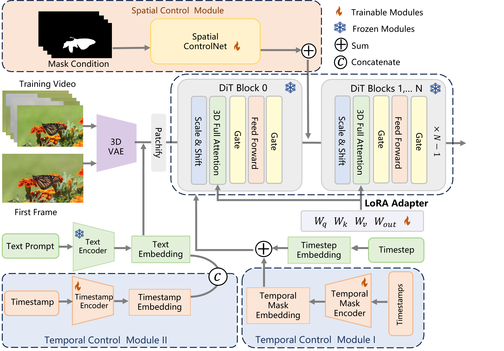

<h1 id="title">🔆 VFX Creator: Animated Visual Effect Generation with Controllable Diffusion Transformer</h1>

  <a href="https://liuxinyv.github.io/" target="_blank">Xinyu Liu</a>1,
  <a href="https://ailingzeng.site/" target="_blank">Ailing Zeng</a>2, 
  <a href="http://undefined" target="_blank">Wei Xue</a>1, 
  <a href="http://undefined" target="_blank">Harry Yang</a>1, 
  <a href="http://undefined" target="_blank">Wenhan Luo</a>1, 
  <a href="http://undefined" target="_blank">Qifeng Liu</a>1,
   <a href="http://undefined" target="_blank">Yike Guo</a>1
    
  1Hong Kong University of Science and Technology 
  2Tencent AI Lab 

   &ensp;
   &ensp;

<h2 id="abstract">🔆 Abstract</h2>

<blockquote>
  
Crafting magic and illusions stands as one of the most thrilling facets of filmmaking, with visual effects (VFX) serving as the powerhouse behind unforgettable cinematic experiences. While recent advances in generative artificial intelligence have catalyzed progress in generic image and video synthesis, the domain of controllable VFX generation remains comparatively underexplored. More importantly, fine-grained spatial-temporal controllability in VFX generation is critical, but challenging due to data scarcity, complex dynamics, and precision in spatial manipulation. In this work, we propose a novel paradigm for animated VFX generation as image animation, where dynamic effects are generated from user-friendly textual descriptions and static reference images. Our work makes two primary contributions: <strong>i) Open-VFX</strong>, the first high-quality VFX video dataset spanning 15 diverse effect categories, annotated with textual descriptions, instance segmentation masks for spatial conditioning, and start–end timestamps for temporal control; This dataset features a wide range of subjects for the reference images, including characters, animals, products, and scenes. <strong>ii) VFX Creator</strong>, a simple yet effective controllable VFX generation framework based on a Video Diffusion Transformer. The model incorporates a spatial and temporal controllable LoRA adapter, requiring minimal training videos. Specifically, a plug-and-play mask control module enables instance-level spatial manipulation, while tokenized start-end motion timestamps embedded in the diffusion process accompanied by the text encoder, allowing precise temporal control over effect timing and pace.  Extensive experiments on the Open-VFX test set with unseen reference images demonstrate the superiority of the proposed system to generate realistic and dynamic effects, achieving state-of-the-art performance and generalization ability in both spatial and temporal controllability. Furthermore, we introduce a specialized metric to evaluate the precision of temporal control. By bridging traditional VFX techniques with generative techniques, the proposed VFX Creator unlocks new possibilities for efficient, user-friendly, and high-quality video effect generation, making advanced VFX accessible to a broader audience.

</blockquote>

<h2 id="open-vfx-dataset-overview">🚁 Overview of Open-VFX Dataset</h2>

<h2 id="demonstration">📝 Demonstration</h2>

## 📝 Demonstration

| Ta-da it | Crumble it | Crush it | Decapitate it | Deflate it |
|----------|------------|----------|---------------|------------|
|  |  |  |  |  |

| Dissolve it | Explode it | Eye-pop it | Inflate it | Levitate it |
|-------------|------------|------------|------------|-------------|
|  |  |  |  |  |

| Melt it | Squish it | Cake-ify it | Hot Harley Quinn | We are Venom |
|---------|-----------|--------------|------------------|---------------|
|  |  |  |  |  |

<h2 id="vfx-creator">😊 VFX Creator</h2>

<h2 id="changelog">⭐ Changelog</h2>

<ul><li>
<strong>[2025.02]</strong>: 🔥 Paper Release.
</li>
</ul>
</body></html>